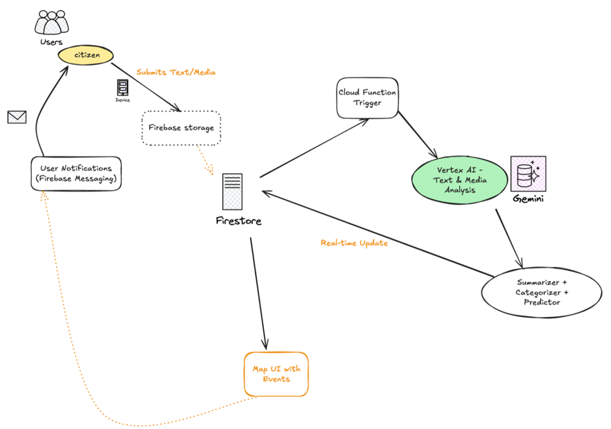

# NextSignal
The Living City Dashboard is a real-time, AI-powered city dashboard that captures the pulse of Bengaluru by intelligently fusing noisy, scattered data like social media posts, civic issue reports, and spontaneous cultural events.

It leverages Google’s Gemini multimodal model via Vertex AI to summarize, categorize, and predict urban trends, all while giving citizens a live, interactive map-based UI and personalized alert subscriptions.

## Features offered:

Event Fusion: Real-time deduplication & summarization (e.g., 20 flood reports → 1 clear update).

Citizen Reporting: Users submit geo-tagged text, photos, or videos.

Auto Categorization: Gemini identifies type (traffic, outage, cultural event, etc.).

Prediction Engine: Clustering reports to predict large-scale disruptions.

Map-based Dashboard: Google Maps UI with live events and filters.

Area Subscription: Get AI-generated alerts for your locality or topic.

Mood Map: Sentiment analysis overlay of Bengaluru neighborhoods.

Push Notifications: Via Firebase Messaging for real-time updates.

